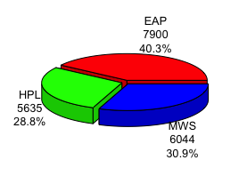
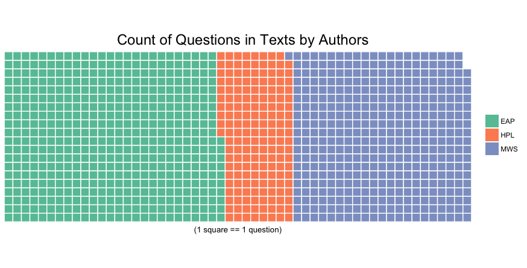
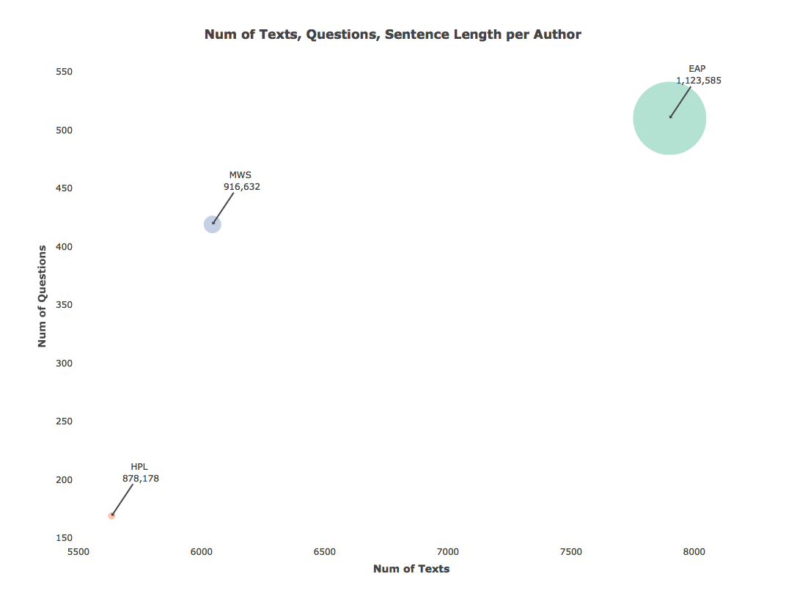
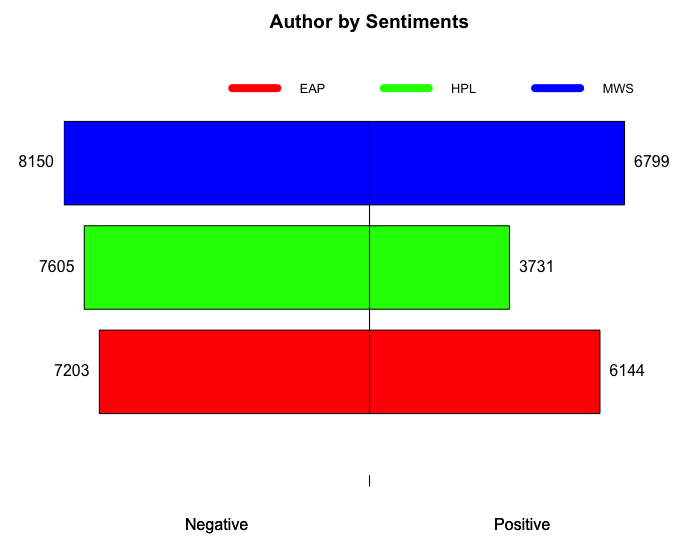
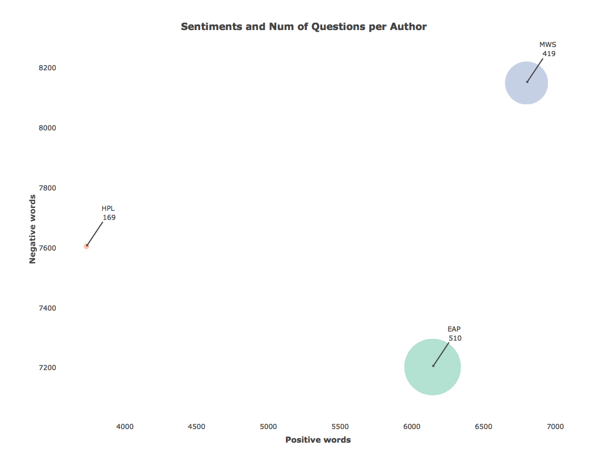

# Spring 2018
# Project 1: Spooky Data Analysis  :jack_o_lantern: :ghost:

## Project Description
This is the first and only *individual* (as opposed to *team*) this semester. 

+ Projec title: Who wrote these spooky texts?

+ This project is conducted by Ginny Gao, Columbia UNI: qg2158

+ Project summary: This project studies writing styles from 3 popular horror authors (1800s to early 1900s): [Edgar Allan Poe (EAP)](https://en.wikipedia.org/wiki/Edgar_Allan_Poe), [HP Lovecraft (HPL)](https://en.wikipedia.org/wiki/H._P._Lovecraft), and [Mary Wollstonecraft Shelley (MWS)](https://en.wikipedia.org/wiki/Mary_Shelley). It compares and contrasts positive and negative emotions in their writing content via sentiment analysis, and also identifies words frequently appear together in the authors' excerpts through topic modeling.

## 1. Who write how many texts in the dataset?

Pie chart shows composition of author's texts in the [spooky](https://github.com/GU4243-ADS/spring2018-project1-ginnyqg/blob/master/data/spooky.csv) dataset.

It appears that most texts belong to EAP (40.3%), followed by MWS (30.9%) and HPL (28.8%). MWS and HPL have about same number of texts in this dataset.

## 2.1 Do some authors use more questions in the texts than others?

* Waffle chart presents the comparison of use of questions in texts among 3 authors.
* Questions are identified with "?" mark in the sentences.

Not suprisingly, EAP uses most number of questions in his texts, as EAP has more texts than others in the dataset. Notice MWS and HPL have approximately same number of texts in the dataset from study [above](#1-who-write-how-many-texts-in-the-dataset), but MWS uses more than twice as many questions in her texts than HPL does. This can be a key identifier to differentiate MWS and HPL's texts.

## 2.2 Are there any differences in authors' use of questions in sentences, compare to their total volume of texts in the dataset?

Bubble chart illustrates the similarities and differences in these quantities for each author.

EAP writes most texts in the dataset, and he also has largest volume of words. Interestingly for MWS, though she doesn't have many texts or nearly as many words as EAP does in the dataset, she uses many questions in her texts. Based on the slopes of where the 3 bubbles are in the chart, MWS uses most questions in her texts compare to the other 2. HPL writes the least in the group, and his use of questions is about the same as EAP.

You may interact with the chart [here](https://github.com/GU4243-ADS/spring2018-project1-ginnyqg/blob/master/doc/Spooky_Data_Analysis.html). You might need to download and save it as html file first.

## 3. How do sentiments compare in these authors' writings?

Pyramid chart displays positive and negative emotional content in different authors' texts.

There are 3 widely used lexicons. `bing lexicon` classifies words into positive or negative categories. Since lexicons stay more concurrent with modern language usage, I am interested in exploring the emotional content of these 3 authors (1800s to early 1900s) in general. Thus, [bing lexicon](https://www.cs.uic.edu/~liub/FBS/sentiment-analysis.html) is chosen for this sentiment analysis.

Firstly, from the pyramid chart, we can see that all 3 authors use words with negative emotions in their texts more than positive ones. After all, they are horror authors! While MWS leads the total number of emotional words in her texts compare to the other 2 authors, her negative to positive words ratio is about the same as EAP's. HPL, on the other hand, uses twice as many negative words than positive words in his writings.

Secondly, I wonder if there is any pattern in quantity of sentiments and use of questions in sentences from these authors. I plotted the bubble chart on these 3 variables.

This bubble chart confirms with the pyramid chart that MWS's texts have the most positive and negative words, and HPL has the least amount of words carry sentiments, though HPL is much more likely to choose a negative word than a positive one when he uses words that carry emotional content. MWS and EAP utilize questions in their texts about 2.5 to 3 times as much as HPL does.

For code used in this analysis, please refer to [`Spooky_Data_Analysis.Rmd`](https://github.com/GU4243-ADS/spring2018-project1-ginnyqg/blob/master/doc/Spooky_Data_Analysis.Rmd) for details.

